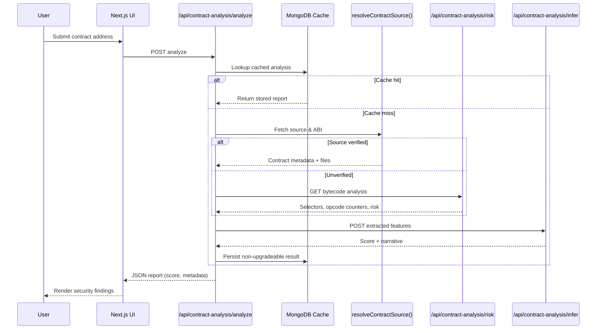

# Owdit - Smart Contract Security Analysis Platform

<div align="center">
  
  
  <h3>AI-Powered Smart Contract Security with Persistent MongoDB Caching</h3>
  
  <p>
    <a href="https://owdit.com">Live Demo</a>
    ·
    <a href="https://youtu.be/WAD32SdsgY0">Demo Video</a>
  </p>

  <a href="https://nextjs.org/">
    
  </a>
  <a href="https://www.typescriptlang.org/">
    
  </a>
  <a href="https://tailwindcss.com/">
    
  </a>
  <a href="https://www.mongodb.com/atlas">
    
  </a>
  <a href="https://0g.ai/">
    
  </a>
</div>

## 🚀 Overview

Owdit is a smart contract security analysis platform that combines bytecode/source analysis, optional AI inference (via 0G Serving Broker), and a persistent MongoDB cache to protect your funds. It automatically scans contracts and serves comprehensive, repeatable reports without re-querying the chain.

### Key Features

- **AI-Powered Analysis**: Optional 0G inference via 0G Serving Broker + heuristic/static checks
- **Instant Results**: Fast results, cached to avoid repeat network calls
- **Persistent Cache**: MongoDB-backed caching with TTL and indexes
- **Dual Analysis**: Works for verified and unverified contracts
- **Upgradeable Detection**: Upgradeable contracts are detected and not cached
- **History & Search**: Real-time history endpoint with pagination and search
- **Modern UI**: Cyberpunk-themed, responsive interface
- **Pay-with-Web3 for AI**: Pay‑as‑you‑go LLM inference using assets you already hold on‑chain (via 0G)

## 🧠 How It Works

- Frontend pages submit contract addresses or raw Solidity code to the `contract-analysis` API namespace.
- The API checks MongoDB first; cache hits return immediately and power the history/stats views.
- Cache misses trigger source resolution via Sourcify/Etherscan or bytecode heuristics with proxy detection when the source is unavailable.
- 0G inference (through 0G Serving Broker) produces AI scoring with safeguards: verified contracts fall back to rule-based scoring, unverified bytecode uses opcode heuristics.
- Non-upgradeable results persist in MongoDB, while upgradeable findings skip caching to avoid stale data.



## 🏗️ Architecture

High‑level: Next.js App (App Router) + serverless API routes, MongoDB Atlas cache (unique + TTL indexes), and optional AI inference via 0G Serving Broker. For full component map, flows, and design choices, see `docs/ARCHITECTURE.md`.

## 🌐 Deployment & Production Readiness

- **Live**: https://owdit.com
- **0G Integration**: Uses 0G Serving Broker for LLM inference and pay‑as‑you‑go usage with on‑chain assets. No on‑chain contracts are required for this flow, so 0G mainnet contract list is not applicable.
- **Storage**: 0G Storage not required by this dapp.
- **Compute/DA**: 0G Compute/DA can remain on testnet.
- **Cache**: MongoDB Atlas with unique + TTL indexes; upgradeable contracts are not cached to avoid staleness.

See `docs/DEPLOYMENT.md` and `docs/OBSERVABILITY.md` for details.

## ✅ 0G Mainnet Contracts

N/A — broker‑based LLM integration; this dapp does not deploy its own on‑chain contracts on 0G. We integrate with the 0G Serving Broker for inference and payments using users’ existing on‑chain assets.

## 🎯 Usage

### Analyze a Contract

1. Go to the ANALYZE page
2. Paste the contract address and select network
3. Click Analyze
   - Fetches source (verified) or bytecode (unverified)
   - Runs analysis (and optional AI inference)
   - Caches non-upgradeable results in MongoDB (TTL ~24h)
   - Returns a unified security report


### View History

1. Open the HISTORY page
2. Browse/search cached analyses
3. Click any item for details

### Learn

1. Open the LEARN page
2. Explore common vulnerabilities and real case studies
3. Follow best practices and guidance

## 🔍 Features Deep Dive

### AI-Powered Analysis

- Security score and qualitative reasoning
- Risk level classification and detection patterns
- Works with verified and unverified contracts
 - Broker‑based LLM inference with pay‑as‑you‑go using on‑chain assets (via 0G)

### Contract Analysis Types

#### Verified Contracts

- Source code and ABI interpretation
- Compiler version aware checks
- Library and inheritance graph insights

#### Unverified Contracts

- Bytecode selector extraction
- Opcode counters and risky pattern signatures

### Cache System

- MongoDB Atlas with unique index on `address + chainId`
- TTL index for automatic expiration (~24 hours)
- Upgradeable contracts are detected and not cached
- History and stats endpoints for observability

## 🧪 Quality, CI/CD & Monitoring

- **CI/CD**: GitHub Actions run a large test suite (>1000 tests) on every push/PR. Coverage is consistently >80%.
  - Workflow: `.github/workflows/unit-tests.yml`
  - Commands: `npm run test`, `npm run test:coverage`
- **Coverage**: Reports available under the `coverage/` directory.
- **Uptime & Alerts**: UptimeRobot monitors public endpoints for availability; alerts enable rapid incident response.
- **Error Tracking**: Sentry is integrated (including performance monitoring) to triage issues quickly.
- **Analytics**: Google Analytics is integrated to measure UX metrics and guide improvements.

See `docs/OBSERVABILITY.md` for setup and operational details.

## 🛠️ Development

### Project Structure

```
src/
├── app/                    # Next.js App Router pages
│   ├── analyze/           # Contract analysis page
│   ├── history/           # Analysis history page
│   ├── learn/             # Educational content page
│   └── api/               # API routes
├── features/              # Feature-specific components
│   ├── analysisResult/    # Analysis display components
│   ├── contractSearch/    # Contract search functionality
│   └── learn/             # Learn page components
├── shared/                # Shared components and utilities
│   ├── components/        # Reusable UI components
│   ├── contexts/          # React contexts
│   └── lib/               # Utils, cache service, schemas
└── types/                 # TypeScript type definitions
```

### Scripts

- Dev: `npm run dev`
- Build: `npm run build`
- Start: `npm start`
- Lint: `npm run lint`

## 🧩 Documentation

- Architecture: `docs/ARCHITECTURE.md`
- 0G Integration: `docs/0G-INTEGRATION.md`
- Deployment: `docs/DEPLOYMENT.md`
- Observability: `docs/OBSERVABILITY.md`
- Security: `docs/SECURITY.md`
- Roadmap: `docs/ROADMAP.md`

## 📝 License

This project is licensed under the MIT License. See `LICENSE` for details.

## 🤝 Contributing

Contributions and feedback are welcome. Feel free to open issues and PRs.

---

Owdit — The watchful owl for your smart contracts. 🔒🦉⚡
