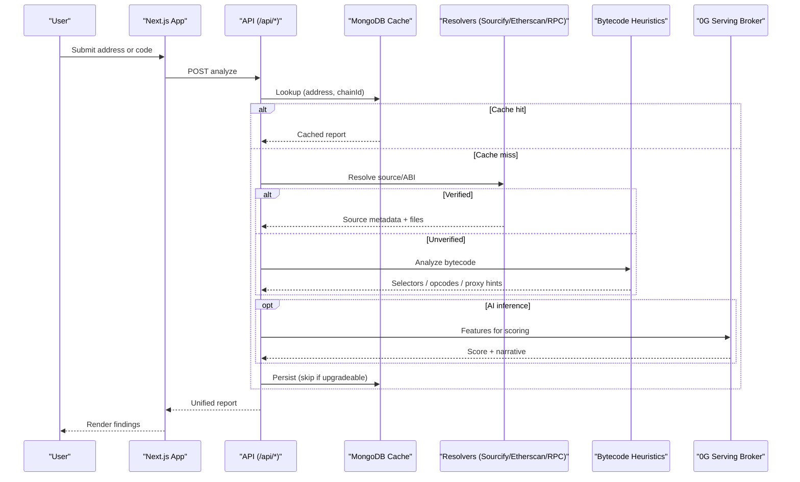

# Architecture

Owdit is a Next.js 15 application with serverless API routes and a persistent MongoDB cache. It integrates with the 0G Serving Broker for LLM inference using on-chain payments.

## System Overview

- UI: React + Tailwind, with Network context
- API: Next.js route handlers under `src/app/api/*`
- Cache: MongoDB Atlas with unique and TTL indexes
- Analysis: Source-aware checks for verified contracts; opcode/signature heuristics for unverified
- 0G: Serving Broker for model routing and pay‑as‑you‑go inference via on‑chain assets

## Runtime Flows

For an in-depth walkthrough of the analysis pipeline (validation, source resolution, bytecode heuristics, unification, AI scoring), see `docs/ANALYSIS.md`.

### Address Analysis

1. UI submits `{ address, chainId }`
2. API checks cache by `(address, chainId)`
3. Cache miss: resolve source via Sourcify/Etherscan; if unavailable, fetch bytecode and run heuristics
4. Extract features; optionally call 0G for scoring and narrative
5. If contract appears upgradeable, skip caching; else persist with TTL
6. Return unified report to UI

### Code Analysis

1. UI submits raw Solidity/code
2. API parses/normalizes and extracts features
3. Optionally call 0G for inference
4. Return findings without caching (ephemeral input)

### 0G Broker Interaction

- Server-side call using configured wallet and RPC to 0G
- Model selection and payment handled by broker
- Deterministic fallbacks used if broker is unreachable

## Modules & Key Files

- App pages: `src/app/*`
  - Analyze: `src/app/analyze/page.tsx`
  - History: `src/app/history/*`
  - Learn: `src/app/learn/*`
- API routes: `src/app/api/contract-analysis/*`
  - Analyze: `src/app/api/contract-analysis/route.ts` (entrypoints split per folder)
  - Risk: `src/app/api/contract-analysis/risk/route.ts`
  - Infer: `src/app/api/contract-analysis/infer/route.ts`
- Shared libs: `src/shared/lib/*`
  - Cache service, schemas, analyzers, import resolver, bytecode analyzer
- Types: `src/types/*`

## Cache Model

- Key: `(address, chainId)` unique index
- TTL: configured (~24h) for automatic expiration
- Policy: upgradeable contracts are detected and not cached

## Error Handling & Reliability

- Input validation at API boundaries (addresses, pagination)
- Safe fallbacks when external services are unavailable
- Structured logs for server, minimal PII

See also:
- Analysis Pipeline: `docs/ANALYSIS.md`
- Observability: `docs/OBSERVABILITY.md`
- 0G Integration: `docs/0G-INTEGRATION.md`
- Deployment: `docs/DEPLOYMENT.md`
